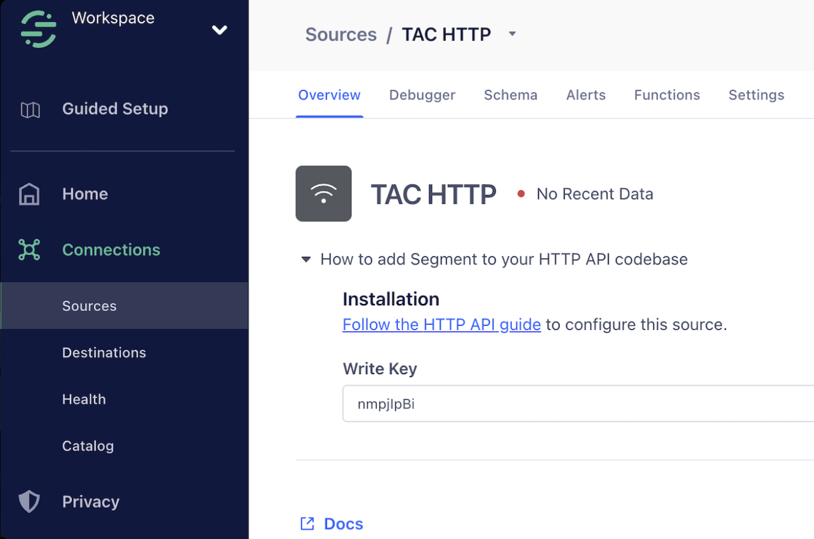
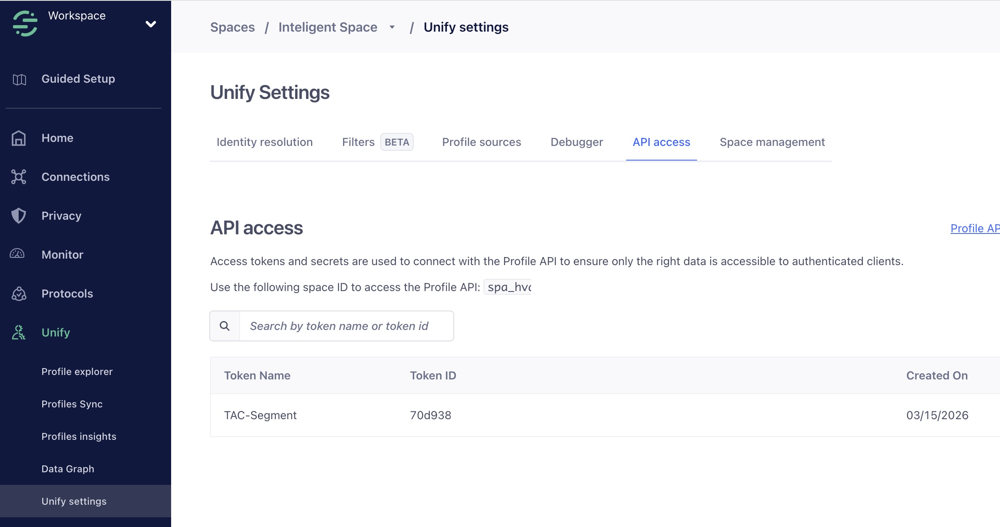

# Twilio Agent Connect (TAC)

Twilio Agent Connect (TAC) is a powerful TypeScript library designed to simplify the development of intelligent,
context-aware applications using Twilio's communication technologies. TAC provides seamless integration with Twilio's
Memory and Conversation services, enabling you to build LLM-powered agents with persistent memory and conversation context.

> [!NOTE]
> Looking for the Python version? Check out [TAC SDK Python](https://github.com/twilio-innovation/twilio-agent-connect-python).

Explore the [getting_started](getting_started) directory to see the SDK in action.

## Key Features

- **SMS Channel Support**: Built-in webhook handling for Twilio SMS conversations
- **Voice Channel Support**: WebSocket protocol handling for Twilio Voice with ConversationRelay
- **Memory Management**: Automatic integration with Twilio Memory for persistent user context
- **Profile Service Abstraction**: Pluggable identity and event tracking with Segment or Memora
- **Conversation Lifecycle**: Automatic tracking of conversation sessions and state
- **Type-Safe**: Full TypeScript support with strict type checking
- **Callback-Based**: Simple `onMessageReady` callback for LLM integration with optional memory retrieval
- **Production Ready**: Comprehensive test coverage and error handling

## Get Started

To get started, set up your Node.js environment (Node.js 20 or newer required).

> [!IMPORTANT]
> TAC packages are not yet published to npm. We recommend building your agent directly in this repository. The TypeScript SDK requires manual environment configuration—there is no automated setup wizard.

### Option 1: Build in This Repository (Recommended)

Clone this repository and work within it:

```bash
git clone https://github.com/twilio-innovation/twilio-agent-connect-typescript.git
cd twilio-agent-connect-typescript

# Install dependencies
npm install

# Build packages
npm run build
```

### Option 2: Install from Local Repository

If you have an existing project, you can install from this local repository:

```bash
# In your project directory
npm install /path/to/twilio-agent-connect-typescript/packages/core
npm install /path/to/twilio-agent-connect-typescript/packages/server
```

## Profile Service Configuration

TAC supports two profile service providers for identity resolution and event tracking:

### Segment (Recommended for New Projects)

> **⚠️ IMPORTANT:** Requires an **upgraded Segment account** for Profile API access. The free tier only provides event tracking.

**Non-blocking, fire-and-forget event tracking** for high-performance applications.

#### Setup:

1. **Create a Segment Source**:
   - Log into [Segment](https://app.segment.com/)
   - Go to **Connections > Sources > Add Source**
   - Select **"Node.js"** (Server category) or **"HTTP API"**
   - Name it (e.g., "TAC Agent Connect")
   - Copy the **Write Key** from the Overview tab

   

2. **Get Space ID and Create Unify Token** (both on same page):

   Navigate to Unify API access page:
   - In Segment left sidebar, click **Unify**
   - Click **Unify settings** at the bottom
   - Click the **API access** tab

   

   **Get Space ID** (top of page):
   - Look for: "Use the following space ID to access the Profile API:"
   - Copy the Space ID (e.g., `spa_hvakucpPfsY4mZ18GCmVmf`)
   - Format **must start with `spa_`**

   **Create Unify API Access Token** (same page, scroll down):
   - View the tokens table (Token Name, Token ID, Created On)
   - Click **"Create API Access Token"**
   - Name it (e.g., `TAC Profile API` or `TAC-Segment`)
   - Select appropriate access level
   - Click **"Create"**
   - **Copy the full token immediately** (you won't see it again)

4. **Configure Environment Variables**:
   ```bash
   PROFILE_SERVICE_PROVIDER=segment
   SEGMENT_WRITE_KEY=your_write_key_here              # Required: from Sources
   SEGMENT_SPACE_ID=spa_xxxxxxxxxxxx                  # Required: from Unify > API access (starts with spa_)
   SEGMENT_UNIFY_TOKEN=your_unify_token_here          # Required: from Unify > API access (same page as Space ID)
   ```

**Performance**: Message reaches LLM in ~5ms (non-blocking)

### Memora (Backward Compatibility)

**Blocking identity resolution** with Twilio Memory API.

```bash
PROFILE_SERVICE_PROVIDER=memora
MEMORY_STORE_ID=mem_service_xxxxx
TWILIO_API_KEY=SKxxxx
TWILIO_API_TOKEN=xxxx
```

**Performance**: SMS messages reach LLM in ~150ms (blocking profile lookup)

### Comparison

| Feature | Segment | Memora |
|---------|---------|--------|
| **Event Tracking** | ✅ identify() + track() | ❌ No event tracking |
| **Profile Storage** | ✅ Profile API | ✅ Memory API |
| **SMS Performance** | 🚀 5ms (non-blocking) | ⏱️ 150ms (blocking) |
| **Voice Performance** | 🚀 5ms (non-blocking) | 🚀 5ms (non-blocking) |
| **LLM Tools** | ✅ retrieve/update profile | ✅ retrieve/update profile |

## Quick Examples

Create Memory and Conversation Configuration services through [Twilio 1Console](https://1console.twilio.com), then configure your `.env` file with the required credentials.

Here's a minimal example to get started:

### Multi-Channel with OpenAI SDK

Build an AI agent that works across both Voice and SMS channels with conversation memory and user context.

First, install the required dependencies in the repository:

```bash
npm install openai dotenv
```

Then create your application (e.g., in `getting_started/examples/` or your own directory):

```typescript
import { config } from 'dotenv';
import OpenAI from 'openai';
import {
  TAC,
  TACConfig,
  VoiceChannel,
  SMSChannel,
} from '@twilio/tac-core';
import { TACServer } from '@twilio/tac-server';

config();

const openai = new OpenAI();

// Initialize TAC and channels
const tac = new TAC({ config: TACConfig.fromEnv() });
const voiceChannel = new VoiceChannel(tac);
const smsChannel = new SMSChannel(tac);

// Register channels
tac.registerChannel(voiceChannel);
tac.registerChannel(smsChannel);

// Store conversation history
const conversationHistory: Record<string, OpenAI.Chat.ChatCompletionMessageParam[]> = {};

// Handle incoming messages
tac.onMessageReady(async ({ conversationId, message, memory, session, channel }) => {
  const convId = conversationId as string;

  if (!conversationHistory[convId]) {
    conversationHistory[convId] = [];
  }

  conversationHistory[convId].push({ role: 'user', content: message });

  const response = await openai.chat.completions.create({
    model: 'gpt-4o-mini',
    messages: conversationHistory[convId]
  });

  const llmResponse = response.choices[0]?.message?.content ?? '';
  conversationHistory[convId].push({ role: 'assistant', content: llmResponse });

  // Send response based on channel
  if (channel === 'voice') {
    await voiceChannel.sendResponse(conversationId, llmResponse);
  } else if (channel === 'sms') {
    await smsChannel.sendResponse(conversationId, llmResponse);
  }
});

const server = new TACServer(tac);
await server.start();
```

> **Note**: See the [getting started guide](getting_started/README.md) for complete setup instructions and `.env` configuration details.

**That's it!** The server automatically:
- Creates Fastify app with `/twiml`, `/ws`, and `/conversation` endpoints
- Handles both Voice and SMS conversations
- Provides conversation memory and user profile in the callback
- Routes responses through the appropriate channel

For configuration details and environment variables, see the [getting started guide](getting_started/README.md).

## How It Works

TAC simplifies building AI agents by handling the integration between Twilio's communication channels and your LLM:

### Message Flow

1. **Webhook/Connection Received**: Twilio sends webhook (SMS) or WebSocket connection (Voice) to your server
2. **Channel Processing**: Channel validates and processes the incoming event
3. **Memory Retrieval**: TAC optionally retrieves user memories and profile from Memory
4. **Callback Invoked**: Your `onMessageReady` callback receives user message, context, and optional memory response
5. **LLM Integration**: Your code calls LLM with message and memories, sends response through the appropriate channel

For detailed architecture and advanced usage, see [CLAUDE.md](CLAUDE.md).

## Learn More

**Examples & Guides:**
- **[Getting Started Guide](getting_started/)** - Setup instructions and comprehensive documentation
- **[OpenAI Example](getting_started/examples/openai/)** - Complete multi-channel example with Voice and SMS

**Documentation:**
- **[CLAUDE.md](CLAUDE.md)** - Architecture, development guide, and API reference
- **[Getting Started Guide](getting_started/README.md)** - Setup instructions, environment variables, and troubleshooting

---

# TAC Development / Contribution

Ensure you have Node.js and npm installed:

```bash
node --version  # Should be 20 or newer
npm --version   # Should be 9 or newer
```

### Setup Development Environment

```bash
# Clone repository
git clone https://github.com/twilio-innovation/twilio-agent-connect-typescript.git
cd twilio-agent-connect-typescript

# Install all dependencies
npm install

# Build all packages
npm run build
```

### Running Tests and Checks

```bash
# Format code
npm run format

# Run linting
npm run lint

# Run type checking
npm run typecheck

# Run tests
npm test

# Run tests in watch mode (for development)
npm run test:watch

# Run all checks at once
npm run build && npm run lint && npm run typecheck && npm test
```

# TAC E2E Tests
[](https://buildkite.com/twilio/tac-e2e-tests-typescript)
