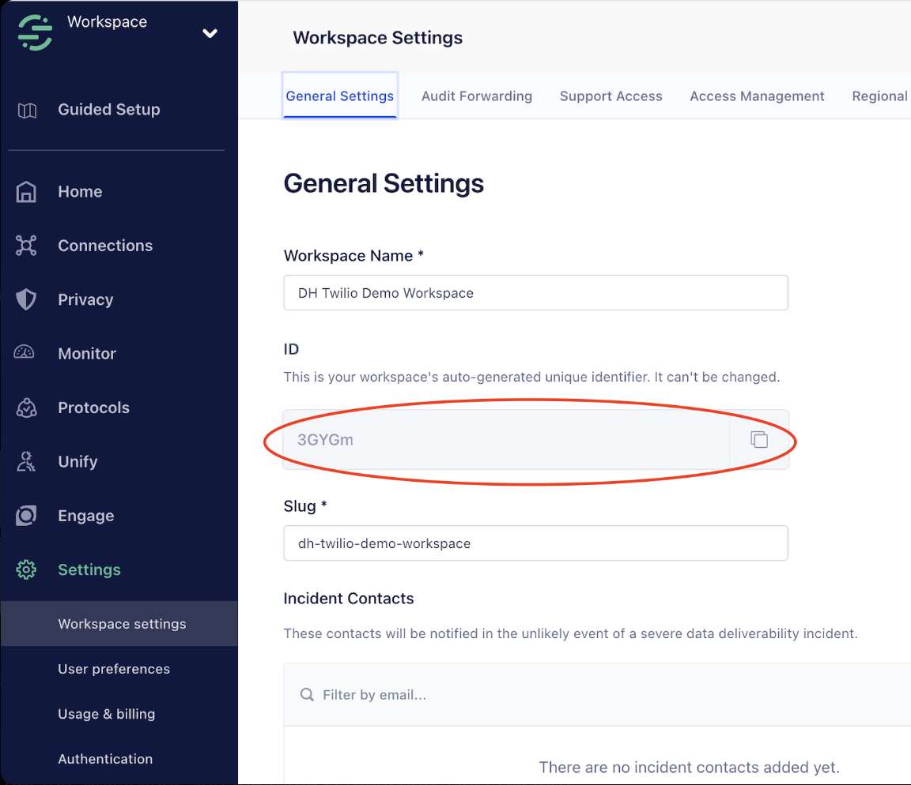

# TAC Exec Connect Demo

A complete, production-ready example demonstrating how to build an AI-powered customer service agent using TAC with both SMS and Voice channels, powered by the OpenAI Agents SDK.

> **Prerequisites:** Ensure you have completed the TAC setup and have the required Twilio and OpenAI credentials.

## Overview

This demo simulates **Owl Internet**, a fictional ISP's customer service agent that can:
- Handle customer inquiries via SMS and Voice
- Track customer identity and events using Segment or Memora
- Retrieve customer context and conversation history using TAC memory
- Look up internet plan pricing and process orders
- Run router diagnostics and check service outages
- Provide personalized responses based on customer profile
- Escalate to human agents when needed (voice only)

**Use Case:** An internet service provider customer can text or call to inquire about plan upgrades, check for outages, run diagnostics, and the AI agent retrieves their current plan, offers relevant options, and processes orders.

## Quick Start: Which Architecture?

This demo supports two architectures. Choose based on your needs:

| Choose Segment (Architecture 2) if you want: | Choose Memora (Architecture 1) if you want: |
|---------------------------------------------|---------------------------------------------|
| ✅ Non-blocking SMS (~5ms latency) | ✅ Simple setup (single data source) |
| ✅ LLM controls when to access memory | ✅ Existing Twilio Memory integration |
| ✅ Application-specific CRM data structure | ✅ Automatic memory pre-fetching |
| ✅ Event tracking and analytics | ✅ No additional storage needed |
| ✅ Hybrid storage (instant + eventual) | ⚠️ Can accept 150ms SMS latency |

**Recommendation**: Use **Segment (Architecture 2)** for new applications with high performance requirements.

## Architecture Overview

This demo supports two distinct architectural approaches for managing customer data and memory:

### Architecture 1: Memora (Traditional TAC Memory)

**Automatic memory pre-fetching with Twilio Memory API**

```
┌─────────────────────────────────────────────────────────────────────┐
│                        Customer Message                             │
│                     (SMS: "What plan do I have?")                   │
└─────────────────────────────────────────────────────────────────────┘
                                 │
                                 ▼
┌─────────────────────────────────────────────────────────────────────┐
│                         TACServer (Fastify)                         │
│                      /conversation webhook                          │
└─────────────────────────────────────────────────────────────────────┘
                                 │
                                 ▼
┌─────────────────────────────────────────────────────────────────────┐
│                         SMSChannel / VoiceChannel                   │
│                                                                     │
│  ⏱️ SMS: ~150ms blocking call to Twilio Memory API                 │
│  🚀 Voice: ~5ms non-blocking (profile cached during connection)    │
└─────────────────────────────────────────────────────────────────────┘
                                 │
                                 ▼
┌─────────────────────────────────────────────────────────────────────┐
│                      Twilio Memory API                              │
│                    (Memora Profile Store)                           │
│                                                                     │
│  • Single source of truth for customer data                        │
│  • Observations, summaries, communications                         │
│  • TAC automatically retrieves and passes to LLM                   │
└─────────────────────────────────────────────────────────────────────┘
                                 │
                                 ▼
┌─────────────────────────────────────────────────────────────────────┐
│                         LLM Service (OpenAI)                        │
│                                                                     │
│  • Receives pre-fetched memory context                             │
│  • No explicit memory tools needed                                 │
│  • Business tools only (get_plans, pricing, diagnostics)           │
└─────────────────────────────────────────────────────────────────────┘
                                 │
                                 ▼
┌─────────────────────────────────────────────────────────────────────┐
│                          Response to Customer                       │
└─────────────────────────────────────────────────────────────────────┘
```

**Configuration:**
```bash
PROFILE_SERVICE_PROVIDER=memora
MEMORY_STORE_ID=mem_store_xxxx
```

**Characteristics:**
- ✅ Simple setup (no additional storage needed)
- ✅ Single source of truth (Twilio Memory)
- ⚠️ SMS blocking latency (~150ms per message)
- ❌ No event tracking

---

### Architecture 2: Segment + LLM Tools (Recommended)

**LLM-driven memory management with hybrid storage**

```
┌─────────────────────────────────────────────────────────────────────┐
│                        Customer Message                             │
│                     (SMS: "What plan do I have?")                   │
└─────────────────────────────────────────────────────────────────────┘
                                 │
                                 ▼
┌─────────────────────────────────────────────────────────────────────┐
│                         TACServer (Fastify)                         │
│                      /conversation webhook                          │
└─────────────────────────────────────────────────────────────────────┘
                                 │
                                 ▼
┌─────────────────────────────────────────────────────────────────────┐
│                         SMSChannel / VoiceChannel                   │
│                                                                     │
│  🚀 SMS: ~5ms (no blocking, identity tracking async)               │
│  🚀 Voice: ~5ms (no blocking)                                       │
└─────────────────────────────────────────────────────────────────────┘
                                 │
                                 ▼
┌─────────────────────────────────────────────────────────────────────┐
│                         LLM Service (OpenAI)                        │
│                                                                     │
│  The LLM decides WHEN to access memory via tools:                  │
│                                                                     │
│  🔧 retrieve_profile - Get CRM data (plan, preferences)            │
│  🔧 update_profile - Save CRM data                                 │
│  🔧 retrieve_memory - Search conversation history                  │
│  🔧 store_memory - Save conversation context                       │
└─────────────────────────────────────────────────────────────────────┘
                    │                              │
                    ▼                              ▼
    ┌──────────────────────────┐    ┌──────────────────────────────┐
    │  CustomerStateStore      │    │  VectorMemoryStore           │
    │  (SQLite - CRM data)     │    │  (SQLite - Semantic search)  │
    │                          │    │                              │
    │  • Plan choices          │    │  • Conversation history      │
    │  • Preferences           │    │  • Embeddings                │
    │  • Account info          │    │  • Semantic search           │
    │  • Application-specific  │    │  • Past interactions         │
    │                          │    │                              │
    │  ⚡ Instant access       │    │  ⚡ Instant access           │
    │  📍 ./customer-state.db  │    │  📍 ./memories.db            │
    └──────────────────────────┘    └──────────────────────────────┘
                    │
                    │ (async, non-blocking)
                    ▼
    ┌──────────────────────────────────────────────────┐
    │           Segment Profile API + Events           │
    │                                                  │
    │  • Unified profiles across all touchpoints      │
    │  • Analytics dashboards                         │
    │  • Event tracking (identify, track)             │
    │                                                  │
    │  ⏱️ Eventual consistency (few seconds delay)    │
    └──────────────────────────────────────────────────┘
```

**Configuration:**
```bash
PROFILE_SERVICE_PROVIDER=segment
SEGMENT_WRITE_KEY=xxx
SEGMENT_SPACE_ID=spa_xxx
SEGMENT_UNIFY_TOKEN=xxx
```

**Characteristics:**
- ✅ Non-blocking everywhere (~5ms)
- ✅ LLM controls when to access memory (intelligent)
- ✅ Application-specific CRM structure
- ✅ Event tracking and analytics
- ✅ Hybrid storage (instant + eventual consistency)

---

## Profile Service Integration

This demo supports two profile service providers with fundamentally different architectures:

### Segment (Recommended) - Architecture 2

See **Architecture 2** diagram above for complete data flow.

- **Performance**: Non-blocking identity and event tracking (~5ms to LLM)
- **Data Flow**: LLM explicitly calls tools to access memory when needed
- **Storage**: Hybrid approach
  - **CustomerStateStore (SQLite)**: Application-specific CRM data (instant)
  - **VectorMemoryStore (SQLite)**: Semantic memory with embeddings (instant)
  - **Segment Profile API**: Unified profiles for analytics (eventual consistency)
- **Features**:
  - `identify()` - Create/update customer identity
  - `track()` - Record events (message_received, call_started)
  - Profile API for trait storage/retrieval
  - LLM tools: `retrieve_profile`, `update_profile`, `store_memory`, `retrieve_memory`
- **Use Case**: High-performance applications with real-time analytics and intelligent memory access

### Memora (Backward Compatible) - Architecture 1

See **Architecture 1** diagram above for complete data flow.

- **Performance**: Blocking identity resolution for SMS (~150ms), non-blocking for Voice (~5ms)
- **Data Flow**: TAC automatically pre-fetches memory and passes to LLM
- **Storage**: Single source of truth (Twilio Memory API)
- **Features**:
  - Profile lookup and caching
  - Memory API integration
  - Automatic memory pre-fetching
  - No event tracking (track() is no-op)
  - No explicit memory tools (TAC handles it)
- **Use Case**: Existing applications using Twilio Memory

### Detailed Comparison

See **Architecture 1 vs Architecture 2** diagrams above for visual comparison.

| Metric | Segment (Architecture 2) | Memora (Architecture 1) |
|--------|--------------------------|-------------------------|
| **SMS to LLM Latency** | 🚀 5ms | ⏱️ 150ms |
| **Voice to LLM Latency** | 🚀 5ms | 🚀 5ms |
| **Memory Access** | 🔧 LLM tools (explicit) | 🤖 Auto pre-fetch (implicit) |
| **Event Tracking** | ✅ Yes (Segment) | ❌ No |
| **Profile Storage** | 📦 Hybrid (SQLite + Segment) | 📦 Single (Memory API) |
| **Read-After-Write** | ⚡ Instant (SQLite) | ⚡ Instant (Memory API) |
| **Analytics** | ✅ Unified profiles, dashboards | ❌ No analytics |
| **Setup Complexity** | Medium | Low |
| **LLM Control** | ✅ Decides when to access memory | ❌ Always gets all memory |

## Files

- **`src/index.ts`** - Main server with TAC initialization and message handling
- **`src/llm-service.ts`** - LLM integration using OpenAI Agents SDK with tool calling
- **`src/tools.ts`** - Business-specific tools (order lookup, pricing, confirmation)
- **`src/business-data.ts`** - Company information and internet plan data

## Environment Variables

Create a `.env` file based on `.env.example`:

```bash
# Required Twilio Configuration
TWILIO_ACCOUNT_SID=ACxxxx
TWILIO_AUTH_TOKEN=xxxx
TWILIO_PHONE_NUMBER=+1xxx
TWILIO_CONVERSATION_SERVICE_SID=CHxxxx

# Twilio API Credentials (Required)
TWILIO_API_KEY=SKxxxx
TWILIO_API_TOKEN=xxxx

# Profile Service Configuration (Choose ONE)
# Option 1: Segment (Recommended - Non-blocking, 97% faster)
PROFILE_SERVICE_PROVIDER=segment
SEGMENT_WRITE_KEY=your_write_key                    # Required: Event tracking (Sources > API Keys)
SEGMENT_SPACE_ID=spa_xxxxxxxxxxxxxxxxxx              # Required: Profile API (Unify > Settings > API access tab)
SEGMENT_UNIFY_TOKEN=your_unify_token                 # Required: Profile API auth (Unify > Settings > API Access)
SEGMENT_ACCESS_TOKEN=sgp_xxxxxxxxxx                  # Optional: Public API token (Settings > Tokens)

# Option 2: Memora (Backward Compatible)
PROFILE_SERVICE_PROVIDER=memora
MEMORY_STORE_ID=mem_store_xxxx

# Required: OpenAI
OPENAI_API_KEY=sk-xxxx

# Voice Configuration (optional)
TWILIO_VOICE_PUBLIC_DOMAIN=your-ngrok-domain.ngrok.app
```

### Setting Up Segment

> **⚠️ IMPORTANT:** Segment **Unify** is required for Profile API access. Verify your account has Unify enabled.

**1. Create a Segment Source (for event tracking):**
   - Log into [Segment](https://app.segment.com/)
   - Navigate to **Connections > Sources**
   - Click **"Add Source"**
   - Select **"Node.js"** source (under "Server" category)
   - Give it a name: `TAC Agent Connect` or `Twilio Customer Service`
   - Click **"Add Source"**
   - On the **Overview** tab, copy the **Write Key** → This is your `SEGMENT_WRITE_KEY`

**2. Find Segment Space ID (required for Profile API):**
   - In Segment, navigate to **Unify > Settings**
   - Click on the **API access** tab
   - You'll see: "Use the following space ID to access the Profile API: `spa_xxxxxxxxxxxxxxxxxx`"
   - Copy the Space ID → This is your `SEGMENT_SPACE_ID`
   - ⚠️ **Important:** Space ID starts with `spa_`, not just alphanumeric

   

**3. Create Unify API Access Token (required for Profile API reads):**
   - In Segment **Unify**, navigate to **Settings > API Access**
   - Click **"Create API Access Token"**
   - Give it a name (e.g., `TAC Profile API Access`)
   - Select **Access type**: Choose appropriate access level for your needs
   - Click **"Create"**
   - Copy the token immediately → This is your `SEGMENT_UNIFY_TOKEN`
   - ⚠️ **Save this token securely** - you won't be able to see it again

   

**4. (Optional) Create Public API Token (for workspace management):**
   - In Segment Settings, navigate to **Access Management > Tokens**
   - Click **"Create Token"**
   - Select **"Public API"** token type
   - Grant **Workspace Member** role with **"Unify and Engage Read-only"** permission
   - Check **"All current and future spaces"** under Assigned Spaces
   - Copy the token → This is your `SEGMENT_ACCESS_TOKEN` (optional)

### Segment Token Summary

| Token | Purpose | Required | Location |
|-------|---------|----------|----------|
| **SEGMENT_WRITE_KEY** | Event tracking (identify, track) | ✅ Yes | Sources > Settings > API Keys |
| **SEGMENT_SPACE_ID** | Profile API access | ✅ Yes | Unify > Settings > API access tab (starts with `spa_`) |
| **SEGMENT_UNIFY_TOKEN** | Profile API authentication | ✅ Yes | Unify > Settings > API Access |
| **SEGMENT_ACCESS_TOKEN** | Public API (optional) | ❌ No | Settings > Workspace Settings > Tokens |

### Data Storage Architecture

This demo uses **hybrid storage** for optimal performance:

1. **CustomerStateStore (SQLite)** - Application-specific CRM data
   - Stores plan choices, preferences, account info
   - Provides immediate read-after-write consistency
   - Specific to THIS application's needs
   - Location: `./customer-state.db`

2. **VectorMemoryStore (SQLite)** - Semantic memory
   - Stores conversation history with embeddings
   - Enables semantic search over past interactions
   - Location: `./memories.db`

3. **Segment** - Analytics and unified profiles
   - Receives all customer events (identify, track)
   - Eventual consistency (few seconds delay)
   - Used for analytics dashboards and unified profiles

**Why this architecture?**
- ✅ Instant CRM data access (no waiting for Segment sync)
- ✅ Application-specific data structure (different apps can have different schemas)
- ✅ Segment still gets all data for analytics/unified profiles
- ✅ Different LLM implementations can have different CRM structures

## Package Architecture

This example uses a **local file reference** to the root TAC package rather than installing from npm:

```json
{
  "dependencies": {
    "twilio-agent-connect": "file:../.."
  }
}
```

### How It Works

1. **Single-Bundle Architecture**: The root `tsup.config.ts` bundles all three packages (`core`, `server`, `tools`) into a single `dist/index.js`
2. **Local Development**: The `file:../..` protocol references the root directory (two levels up from `examples/exec-connect-demo/`)
3. **Unified Imports**: All imports use the single package name:
   ```typescript
   import { TAC, TACServer, SMSChannel, VoiceChannel } from 'twilio-agent-connect';
   ```

### Setup Process

When you run `npm install` in this directory:
1. npm creates a symlink in `node_modules/twilio-agent-connect` → `../../`
2. This allows TypeScript and Node.js to resolve imports from the built root package
3. Changes to the root package require rebuilding: `npm run build` (from root)

### Why Not npm Workspaces?

This monorepo intentionally **does not use npm workspaces**. Instead:
- Examples reference the root package via `file:` protocol
- The root package exports everything from `src/index.ts`
- Build system uses esbuild aliases (see root `tsup.config.ts`)

This pattern matches the `getting_started/examples/openai` example.

## Running the Demo

### 1. Install and Build

From the repository root:

```bash
# Install and build core packages
npm install
npm run build
```

### 2. Start the Server

Navigate to the example directory and start:

```bash
cd examples/exec-connect-demo
npm install
npm run dev
```

The server will start on `http://0.0.0.0:8000` with:
- `/conversation` - Conversations Configuration webhook (routes to SMS/Voice channels)
- `/twiml` - Voice webhook endpoint
- `/ws` - Voice WebSocket endpoint

### 3. Test with SMS

**Setup Twilio Conversation Configuration Webhook:**

1. Start ngrok tunnel:
   ```bash
   ngrok http 8000 --domain=your-ngrok-domain
   ```

2. Your ngrok URL will be `https://your-ngrok-domain`

3. Configure Conversation Configuration Webhook:
   1. In the [Twilio Console](https://console.twilio.com/), navigate to **Conversations > Configuration**
   2. Select your Conversation Configuration
   3. Set **Post-Event URL** to: `https://your-ngrok-domain/conversation`
   4. Select **`POST`** as the HTTP method
   5. Click **Save changes**

4. Send an SMS to your Twilio phone number to interact with the agent

> **Note:** SMS webhook on the phone number itself is NOT needed. The Conversations Configuration webhook handles all routing.

### 4. Test with Voice

1. Start ngrok tunnel (if not already running):
   ```bash
   ngrok http 8000 --domain=your-ngrok-domain
   ```

2. Update `.env` with ngrok domain:
   ```bash
   TWILIO_VOICE_PUBLIC_DOMAIN=your-ngrok-domain
   ```

3. Configure Twilio phone number Voice webhook:
   1. Go to [Phone Numbers > Manage > Active numbers](https://console.twilio.com/us1/develop/phone-numbers/manage/active)
   2. Select your phone number
   3. Set **A CALL COMES IN** webhook to: `https://your-ngrok-domain/twiml`

4. Call your Twilio phone number to interact with the voice agent

## Key Features

### 1. Multi-Channel Support

The same logic handles both SMS and Voice:

```typescript
if (context.channel === 'sms') {
  await smsChannel.sendResponse(conversationId, response);
} else if (context.channel === 'voice') {
  await voiceChannel.sendResponse(conversationId, response, 'assistant');
}
```

### 2. Memory Integration

TAC automatically retrieves customer context:

```typescript
tac.onMessageReady(async (userMessage, context, memoryResponse) => {
  // Memory response contains:
  // - observations: User preferences, past interactions
  // - summaries: Conversation summaries
  // - communications: Historical conversation sessions

  const llmResponse = await llmService.processMessage(
    userMessage,
    memoryResponse,
    context,
    websocket,
    conversationHistory
  );
});
```

### 3. Business Tools with OpenAI Agents SDK

Custom tools for business logic:

```typescript
export const lookUpOrderPrice = functionTool({
  name: 'look_up_order_price',
  description: 'Get pricing for internet plan upgrade',
  parameters: {
    type: 'object',
    properties: {
      planSpeed: {
        type: 'string',
        description: 'Target internet speed (e.g., "1000 Mbps")',
      },
    },
    required: ['planSpeed'],
  },
  execute: async ({ planSpeed }) => {
    // Business logic here
    return pricingInfo;
  },
});
```

The LLM agent automatically calls these tools when needed.

### 4. Conversation History Management

User-managed conversation history for context:

```typescript
const conversationMessages = new Map<string, ChatCompletionMessageParam[]>();

// Add messages to history
history.push({ role: 'user', content: userMessage });
history.push({ role: 'assistant', content: llmResponse });
```

## Example Conversation Flow

### Segment Architecture Flow (Architecture 2)

**Customer (via SMS):** "I want to upgrade my internet plan"

1. **Webhook received** → `/conversation` endpoint (Conversations Configuration webhook)
2. **Routed to SMS channel** → Based on `author.channel` field in webhook payload (~5ms)
3. **Identity tracking** → Segment records `message_received` event (async, non-blocking)
4. **Message ready callback** → Triggers immediately with context
5. **LLM processes** → Agent decides to call `retrieve_profile` tool
6. **Profile retrieved** → Reads from CustomerStateStore (SQLite) for instant access
7. **LLM decides next step** → Calls `look_up_order_price("1000 Mbps")` business tool
8. **Response generated** → "Based on your current 500 Mbps plan, you can upgrade to..."
9. **LLM saves context** → Calls `update_profile` or `store_memory` tools
10. **Profile updated** → Writes to CustomerStateStore (instant) + syncs to Segment (async)
11. **Response sent** → Via SMS channel back to customer

**Key difference**: LLM explicitly controls when to access memory via tools.

### Memora Architecture Flow (Architecture 1)

**Customer (via SMS):** "I want to upgrade my internet plan"

1. **Webhook received** → `/conversation` endpoint (Conversations Configuration webhook)
2. **Routed to SMS channel** → Based on `author.channel` field in webhook payload
3. **Memory pre-fetched** → TAC calls Memora Memory API (blocking, ~150ms)
4. **Message ready callback** → Triggers with pre-fetched memory context
5. **LLM processes** → Agent receives all memory automatically, uses business tools
6. **Tool execution** → Calls `look_up_order_price("1000 Mbps")`
7. **Response generated** → "Based on your current 500 Mbps plan, you can upgrade to..."
8. **Response sent** → Via SMS channel back to customer

**Key difference**: TAC automatically pre-fetches all memory before LLM sees the message.

## Customization

### Adding New Tools

1. Define tool in `src/tools.ts`:
   ```typescript
   export const myCustomTool = functionTool({
     name: 'my_custom_tool',
     description: 'Tool description',
     parameters: {
       type: 'object',
       properties: {
         param: { type: 'string', description: 'Parameter description' },
       },
       required: ['param'],
     },
     execute: async ({ param }) => {
       // Implementation
       return result;
     },
   });
   ```

2. Add to `llm-service.ts` baseTools array

### Updating Business Data

Modify `src/business-data.ts` to update:
- Company information
- Internet plans and pricing
- Router models and specifications
- Any business-specific constants

### Changing LLM Model

Update in `src/llm-service.ts`:
```typescript
const agent = new Agent({
  name: 'Owl Internet Customer Service',
  instructions: enhancedInstructions,
  model: 'gpt-4o-mini',  // Change model here
  tools,
});
```

## Tools Available

### Business Tools (All Architectures)

1. **get_available_plans** - List all internet plans with details
2. **look_up_order_price** - Get pricing for specific plan speed
3. **look_up_outage** - Check for service outages by zip code
4. **run_diagnostic** - Check router compatibility with plan
5. **look_up_discounts** - Find available discounts and promotions
6. **confirm_order** - Send order confirmation via SMS (with TAC integration)
7. **flex_escalate_to_human** - Escalate to human agent in Flex (voice only)

### Profile/Memory Tools (Segment Architecture 2 Only)

8. **retrieve_profile** - Get customer CRM data (plan, preferences, account details)
   - Reads from CustomerStateStore (SQLite) for instant access
   - Optionally merges with Segment Profile API data
9. **update_profile** - Update customer CRM data
   - Writes to CustomerStateStore (instant)
   - Syncs to Segment Profile API (async)
10. **retrieve_memory** - Search conversation history semantically
    - Uses VectorMemoryStore with embeddings
    - Finds relevant past interactions
11. **store_memory** - Save conversation context for future retrieval
    - Stores in VectorMemoryStore with embeddings
    - Enables semantic search

> **Note**: In Memora Architecture 1, profile/memory tools are not needed because TAC automatically handles memory retrieval and passes it to the LLM.

## Technology Stack

- **TypeScript** - Type-safe development
- **TAC (Twilio Agent Connect)** - Multi-channel framework
- **TACServer (Fastify)** - High-performance HTTP server
- **OpenAI Agents SDK** - AI agent orchestration with tools
- **Twilio SDK** - Platform integration
- **WebSocket (ws)** - Real-time voice communication

## Next Steps

- Integrate with real customer database
- Add authentication and authorization
- Implement analytics and monitoring
- Connect to actual billing systems
- Add more sophisticated diagnostics
- Integrate with CRM systems
